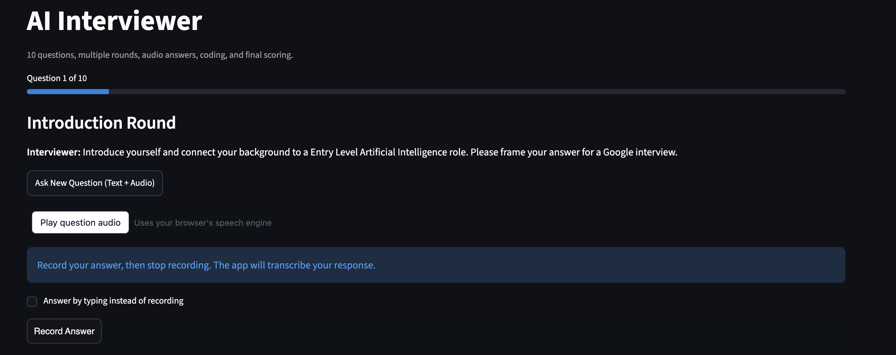
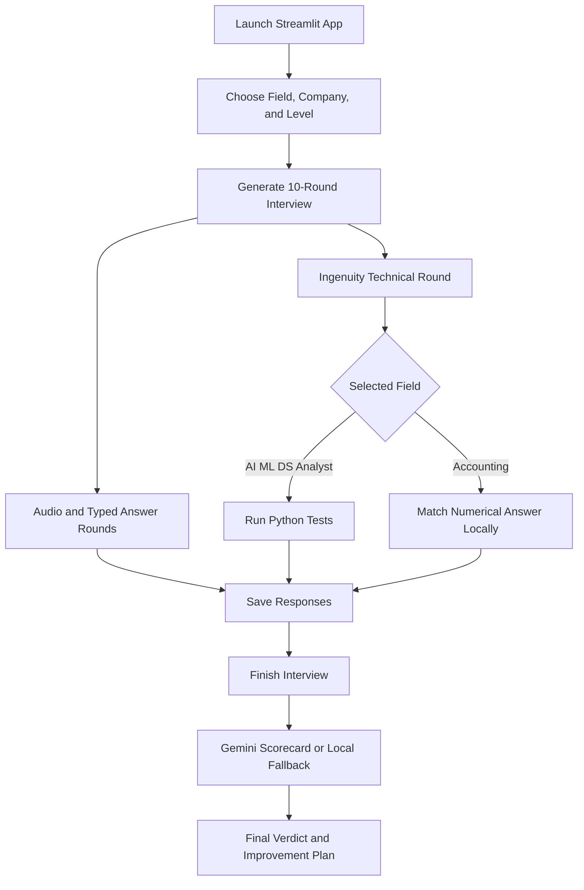
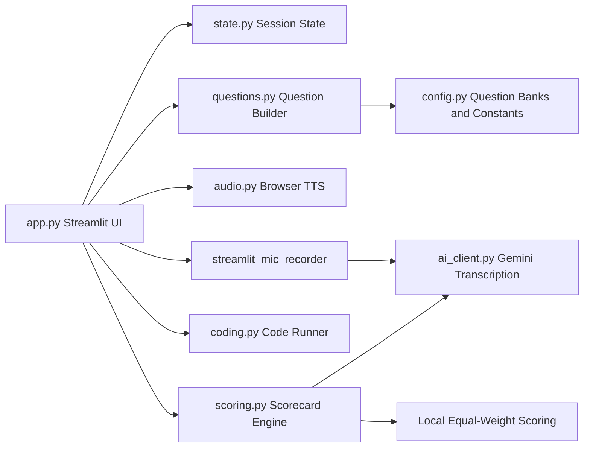

# AI Interviewer App

[](https://www.python.org/)
[](https://streamlit.io/)
[](https://cloud.google.com/genai)
[](LICENSE)
[](#contributing)
[](https://github.com/Vipeen21)
[](https://github.com/Vipeen21/AI-Interviewer/stargazers)
[](https://github.com/Vipeen21/AI-Interviewer/fork)



---

# AI Interviewer App


A professional Streamlit interview simulator for AI, Machine Learning, Data Science, Data Analyst, and Big Four Accounting interview preparation.

AI Interviewer App turns mock interview practice into a structured, interactive experience with audio questions, typed answers, field-specific technical rounds, Gemini-powered transcription, final scorecards, and local fallback scoring.


## Why This Project Stands Out

| Capability | What It Does | Why It Matters |
| --- | --- | --- |
| Structured interview flow | Runs a 10-question interview from setup to scorecard | Makes practice feel realistic and repeatable |
| Audio question playback | Reads questions aloud using browser speech synthesis | Builds comfort with spoken interview settings |
| Audio and typed responses | Lets users record answers or type manually | Supports flexible interview preparation |
| Gemini transcription | Converts recorded audio into interview responses | Reduces manual note-taking |
| Field-specific questions | Supports AI, ML, Data Science, Data Analyst, and Accounting | Makes preparation more targeted |
| Big Four Accounting mode | Includes Deloitte, KPMG, PwC, and EY context | Useful for audit, advisory, and finance candidates |
| Ingenuity Technical round | Uses code tests for technical fields and numeric checks for Accounting | Keeps assessment aligned with the selected domain |
| Equal-weight scoring | Gives each question 10 marks, total 100 | Makes scoring transparent |
| Final verdict | Shows answered count, score, coding attempt, and verdict together | Gives immediate interview-readiness feedback |

## Supported Interview Tracks

| Field | Technical Round Behavior | Companies |
| --- | --- | --- |
| Artificial Intelligence | Python coding problem with visible tests | Google, Microsoft, Meta, Amazon, Deloitte, KPMG, PwC, EY |
| Machine Learning | Python coding problem with visible tests | Google, Microsoft, Meta, Amazon, Deloitte, KPMG, PwC, EY |
| Data Science | Python coding problem with visible tests | Google, Microsoft, Meta, Amazon, Deloitte, KPMG, PwC, EY |
| Data Analyst | Python coding problem with visible tests | Google, Microsoft, Meta, Amazon, Deloitte, KPMG, PwC, EY |
| Accounting | Numerical answer matching for accounting/finance problems | Deloitte, KPMG, PwC, EY |

## Product Workflow



## System Architecture



## Interview Rounds

| Round | Type | Purpose |
| --- | --- | --- |
| Introduction | Audio or typed | Candidate background and role fit |
| Project | Audio or typed | Practical experience and impact |
| Behavioral Feedback | Audio or typed | Growth mindset and coachability |
| Behavioral Communication | Audio or typed | Stakeholder communication |
| Technical Fundamentals | Audio or typed | Core domain understanding |
| Technical Scenario | Audio or typed | Applied problem solving |
| Technical Design | Audio or typed | System or process design thinking |
| Ingenuity Technical | Coding or numeric | Field-specific technical assessment |
| Coding Explanation | Audio or typed | Explain approach, edge cases, and tradeoffs |
| Closing | Audio or typed | Final pitch and readiness |

## Scoring Logic

The fallback scoring system uses equal marks:

```text
10 questions x 10 marks = 100 marks
```

Top summary format:

```text
Answered: 1/10 | Overall score: 10/100 | Coding attempt: Yes | Final verdict: No Hire
```

Gemini can generate a richer final scorecard when available. If Gemini is missing, quota-limited, or unavailable, the app falls back to local scoring.

## Accounting Ingenuity Technical Round

Accounting problems are designed differently from programming problems.

The editor shows the given variables and asks the user to enter only the numerical answer after the answer marker.

Example:

```text
Current Assets: $500,000
Current Liabilities: $200,000

# Numerical answer only:
2.5
```

For multiple-answer questions, enter one numerical answer per line.

```text
15%
1.67
```

Accounting answer checking is local and does not use Gemini.

## Quick Start

1. Clone the repository.

```bash
git clone https://github.com/Vipeen21/AI-Interviewer.git
cd AI-Interviewer
```

2. Install dependencies.

```bash
pip install streamlit streamlit-mic-recorder google-genai numpy pandas
```

3. Run the app.

```bash
streamlit run app.py
```

4. Open the local URL shown by Streamlit.

```text
http://localhost:8501
```

## Gemini Configuration

Gemini is used for audio transcription and AI-generated final scoring.

### Option 1: Streamlit Secrets

Create `.streamlit/secrets.toml`:

```toml
GEMINI_API_KEY = "your_api_key_here"
```

### Option 2: Environment Variable

```bash
export GEMINI_API_KEY="your_api_key_here"
```

The app still runs without a Gemini API key, but transcription and Gemini-based scoring will be unavailable.

## Project Structure

```text
.
├── app.py          # Main Streamlit app and UI flow
├── config.py       # Fields, companies, question banks, accounting problems, Gemini config
├── questions.py    # Question generation and fallback selection
├── scoring.py      # Final scorecard and equal-weight fallback scoring
├── coding.py       # Python code execution and visible test runner
├── ai_client.py    # Gemini transcription and scoring calls
├── audio.py        # Browser text-to-speech question playback
└── state.py        # Streamlit session state helpers
```

## Comparative Advantage

| Feature | AI Interviewer App | Generic Practice Apps | Traditional Mock Interviews |
| --- | --- | --- | --- |
| Structured 10-round flow | Yes | Sometimes | Depends on interviewer |
| Audio playback | Yes | Sometimes | Yes |
| Audio transcription | Yes, with Gemini | Rare | Manual notes |
| Typed fallback | Yes | Yes | No |
| Big Four Accounting mode | Yes | Rare | Sometimes |
| Technical coding tests | Yes | Sometimes | Depends |
| Accounting numeric checks | Yes | Rare | Manual |
| Equal-weight scorecard | Yes | Rare | Subjective |
| Local fallback scoring | Yes | No | No |

## SEO Keywords

`AI interviewer`, `mock interview app`, `Streamlit interview coach`, `Gemini transcription`, `machine learning interview prep`, `data science interview simulator`, `Big Four accounting interview`, `Deloitte interview prep`, `KPMG interview prep`, `PwC interview prep`, `EY interview prep`, `technical interview practice`, `Python coding assessment`.

## Social Hashtags

`#AIInterview` `#MachineLearning` `#DataScience` `#Accounting` `#BigFour` `#Streamlit` `#GeminiAI` `#OpenSource` `#PythonProjects` `#CareerTech`

## Roadmap

| Phase | Planned Work |
| --- | --- |
| Phase 1 | Add persistent interview history and downloadable reports |
| Phase 2 | Add resume-based question personalization |
| Phase 3 | Add dashboard analytics for strengths and weak areas |
| Phase 4 | Add role-specific templates for finance, economics, and consulting |
| Phase 5 | Add deployment-ready configuration and hosted demo |

## Troubleshooting

<details>
<summary>ModuleNotFoundError: streamlit_mic_recorder</summary>

Install the recorder package:

```bash
pip install streamlit-mic-recorder
```

Then restart Streamlit.

</details>

<details>
<summary>Gemini transcription or scoring is unavailable</summary>

Check that `GEMINI_API_KEY` is set in Streamlit secrets or your environment.

The app will continue running with local fallback scoring.

</details>

<details>
<summary>Currency values display incorrectly</summary>

The app renders question text safely to prevent Markdown math parsing issues with values like `$500,000`.

If you edit the UI, avoid rendering currency-heavy prompts directly with raw Markdown.

</details>

<details>
<summary>Accounting answer is marked incorrect</summary>

Enter only the final numerical answer after the marker.

Use one line per answer for multi-answer questions.

</details>

## Contributing

1. Fork the repository.
2. Create a feature branch.

```bash
git checkout -b feature/your-feature-name
```

3. Make your changes.
4. Test the app locally.

```bash
streamlit run app.py
```

5. Open a pull request with a clear summary.

## Call To Action

If this project helps you prepare for interviews or inspires your own AI career tools:

- Star the repository
- Fork it and customize the question banks
- Share it with learners preparing for AI, data science, analytics, and Big Four interviews

Build better interview confidence with structured practice, clear feedback, and domain-aware technical assessment.
