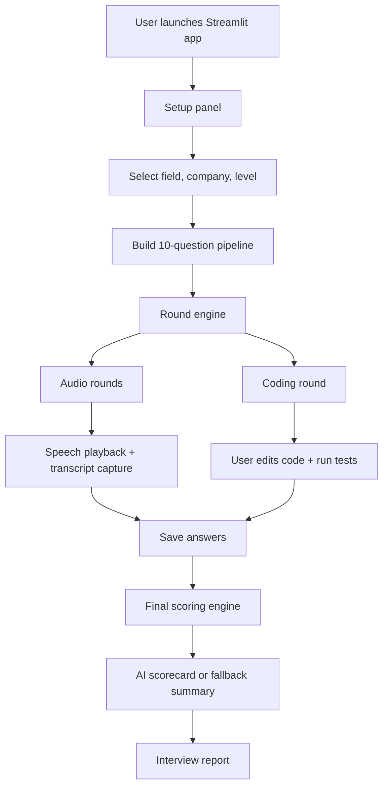
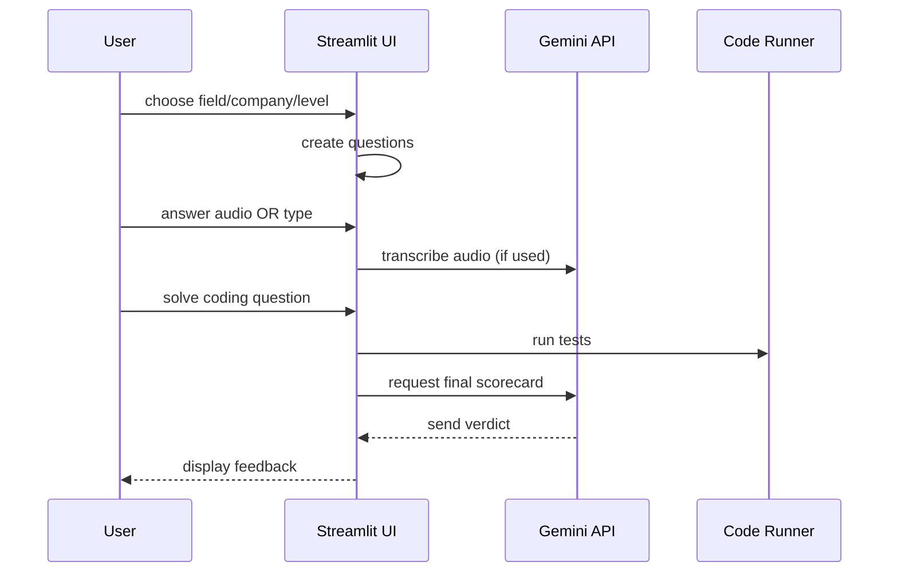

# AI Interviewer App

[](https://www.python.org/)
[](https://streamlit.io/)
[](https://cloud.google.com/genai)
[](LICENSE)
[](https://github.com/your-username)
[](https://github.com/your-username/ai-interviewer-app/stargazers)
[](https://github.com/your-username/ai-interviewer-app/fork)

---

## 🚀 What is this?

AI Interviewer App is a professional, browser-based interview simulator built for Economics, Finance, AI, Machine Learning, Data Science, and Accounting candidates. It combines:
- audio-first interview coaching,
- real-time typed-answer capture,
- Big Four company-specific context,
- Gemini-based transcription/scoring,
- coding assessment with live test execution,
- polished final scorecards.

> Transform raw interview preparation into an engaging, product-ready career launchpad.

---

## ⭐ Why it stands out

- **Multi-domain coverage:** AI, ML, Data Science, Data Analyst, Accounting
- **Big Four-ready:** Deloitte, KPMG, PwC, EY plus top tech companies
- **Audio & typed response modes:** flexible candidate experience
- **Bias-resistant fallback scoring:** works even when Gemini quota is limited
- **Full lifecycle feedback:** final verdict, strengths, weaknesses, improvement plan
- **Streamlit-first UI:** fast prototyping, shareable, interactive

---

## 🔧 Live demo and installation

### Live project link
[Launch the AI Interviewer Demo](https://your-live-domain.com)

### Run locally
```bash
git clone https://github.com/your-username/ai-interviewer-app.git
cd ai-interviewer-app
pip install -r requirements.txt
streamlit run app.py
```

---

## 📌 Feature Matrix

| Feature | Why it matters | Built for |
|---|---|---|
| Audio question playback | Natural interview practice | Voice-first candidates |
| Typed answer mode | Accessibility + low-bandwidth | Finance / Accounting professionals |
| Big Four company context | Realistic consulting recruitment prep | Deloitte / KPMG / PwC / EY |
| Gemini transcription + scoring | AI-powered evaluation | premium interview coaching |
| Final scorecard | Data-backed verdict + improvement plan | hiring managers / self-review |
| Python coding assessment | live test evaluation and feedback | ML / Data Science / Analyst roles |

---

## 🧠 Product architecture



---

## 🧩 System design breakdown

### Core modules
- app.py — main Streamlit orchestrator
- config.py — field/company constants, Gemini API bootstrap
- questions.py — interview question generation and fallback templates
- ai_client.py — Gemini audio transcription and prompt handling
- audio.py — browser TTS streaming
- coding.py — runtime code execution and test harness
- state.py — session state management
- scoring.py — final scorecard generator with graceful fallback

### Technology stack
- Python 3.12+
- Streamlit
- Google Gemini (`google.genai`)
- `streamlit_mic_recorder`
- browser speech synthesis
- JSON-driven interview flow

---

## 📈 Workflow



---

## 📊 Comparative advantage

| Capability | This App | Generic practice apps | Traditional mock interviews |
|---|---|---|---|
| Big Four accounting context | ✅ | ❌ | ❌ |
| Gemini-powered transcript scoring | ✅ | ❌ | ❌ |
| Audio playback + transcript capture | ✅ | ✅ | ❌ |
| Full audit trail of answers | ✅ | ❌ | ✅ |
| Fast local fallback scoring | ✅ | ❌ | ❌ |
| Rapid prototyping in Streamlit | ✅ | ❌ | ❌ |

---

## 🎯 SEO and virality strategy

- Keywords: `AI interviewer`, `Streamlit interview coach`, `Gemini transcription`, `Big Four interview prep`, `ML interview simulator`, `Data Science assessment`
- Hashtags:
  - `#AIInterview`
  - `#MachineLearning`
  - `#DataScience`
  - `#Finance`
  - `#BigFour`
  - `#Streamlit`
  - `#OpenSource`
- CTAs:
  - `Try the demo now`
  - `Star the repo`
  - `Fork and customize your interview flow`
  - `Share with your learning community`

---

## 📌 What’s included

- 10-question structured interview
- company-specific question framing
- audio playback with browser TTS
- typed answer fallback for accessibility
- coding prompt tailored by chosen field
- automated code unit testing
- final scorecard with verdict and improvement plan
- local fallback scoring if Gemini quota or API fails

---

## 🚀 Future roadmap

### Phase 1 — High priority
- [ ] Add live candidate dashboard analytics
- [ ] Add resume parsing to personalize questions
- [ ] Add interview session saving and replay

### Phase 2 — Growth
- [ ] Add interactive video mock interview mode
- [ ] Add company-specific staging for Google, Microsoft, Meta
- [ ] Add team-based peer review workflows

### Phase 3 — Expansion
- [ ] Publish SaaS version with user accounts
- [ ] Add certified coaching workflows
- [ ] Add multi-language interview support

---

## 🤝 Contribution guide

1. Fork the repo
2. Create a feature branch
3. Add tests and update README
4. Open a PR with a clear summary
5. Use tags: `enhancement`, `bug`, `feature`

---

## 🧾 License

This project is open source and licensed under the **MIT License**.

---

## 📣 Ready to scale your interview prep?

- ⭐ Star the repo
- 🍴 Fork it and build your own AI hiring lab
- 🧠 Share with your network: `#AIInterview #DataScience #BigFour #Streamlit`

> Build your next job-winning interview toolkit with the most compelling AI+audio coaching experience for finance, economics, machine learning, and data science candidates.
